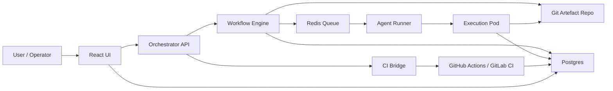

# Plan -> Prove -> Merge

## Thesis

Build an agent-factory platform that takes a software change from vague intent to merged code through a controlled workflow:

`requirements enrichment -> architecture/docs -> master plan + delegated subplans -> HITL approval with visualisation -> coding agents -> unit tests in container -> PR agent integration tests -> EDD/TDD gates -> merge`

The system must be deterministic, auditable, stateful, and hostile to guesswork. Agents do not exist to be broadly helpful. They exist to produce mergeable work with traceability, bounded risk, and explicit failure states.

## Core Outcome

The product is a visual orchestrator for a swarm of agents. It must:

- manage runs, tasks, approvals, retries, and failures;
- let a human start, pause, stop, inspect, and approve agents;
- spawn agents from a prompt library or a custom system prompt;
- run each agent in an isolated pod from a manifest;
- store structured run metadata, logs, and artefacts;
- enforce unit, integration, and evaluation gates before merge.

## Scope

### In Scope

- Workflow orchestration across enrichment, architecture, planning, execution, validation, and merge.
- Agent definitions via YAML config for skills, lifecycle, goals, and memory model.
- Stateful task orchestration with Redis queue and Postgres metadata.
- Git-backed artefact storage for docs, plans, code patches, and PR material.
- Containerised execution for coding and unit test steps.
- PR validation through integration tests, eval gates, and review checklist generation.
- React UI for run control, logs, approvals, task graph visualisation, and agent spawning.
- CI integration via GitHub Actions or GitLab CI.

### Out of Scope

- Fully autonomous production deployment without human approvals.
- Self-modifying orchestration policy without versioned review.
- Unbounded multi-repo dependency resolution in the first release.

## Planning Assumptions

These are explicit assumptions, not facts:

- `Whitefield` is treated as a new-service scenario, equivalent to greenfield.
- The first release targets one primary Git host and one primary CI system, even if adapters are designed for both GitHub Actions and GitLab CI.
- Pods are short-lived and task-scoped, not long-running conversational agents.
- The big-model planner and small-model executor are external model providers wrapped by local orchestration code.

## System Principles

- Every stage must emit structured, machine-consumable artefacts.
- No agent may silently fill gaps in requirements, architecture, or task scope.
- Uncertainty that affects correctness must produce `BLOCKED` or `NEEDS_HUMAN`.
- Task definitions must be small enough to keep PRs reviewable.
- Tests are mandatory evidence, not optional polish.
- The orchestrator is the source of truth for lifecycle state. Agents are workers, not workflow owners.

## End-to-End Workflow

### 1. Enrichment

Input:

- raw idea or change request;
- repository context, if brownfield;
- operating constraints;
- user-supplied acceptance criteria, if any.

Output:

- requirements document;
- assumptions register;
- open questions;
- measurable acceptance criteria;
- risks and mitigations;
- system context summary.

Rules:

- no architecture proposals;
- no technology invention;
- block if missing information affects correctness.

### 2. Architecture

Input:

- approved requirements artefact.

Output:

- system context;
- service and container boundaries;
- interfaces and contracts;
- deployment model;
- observability baseline;
- security model;
- architecture risks and failure modes.

Rules:

- no implementation tasks;
- no speculative requirements;
- block if requirements do not support a defensible design.

### 3. Master Planning

Input:

- approved requirements and architecture.

Output:

- milestones;
- dependency-aware DAG;
- task ordering;
- gating strategy;
- evaluation checkpoints;
- reviewable PR size targets.

Rules:

- every task must be independently testable;
- risk-heavy tasks move earlier;
- each task must produce a delegated task-plan artefact.

### 4. Delegated Task Planning

Input:

- one approved DAG node.

Output:

- exact task goal;
- expected files touched;
- interfaces touched;
- implementation steps;
- unit tests required;
- integration impact;
- rollback plan;
- definition of done.

Rules:

- strict template only;
- no code generation;
- one task per plan.

### 5. HITL Approval

Human reviews:

- requirements completeness;
- architecture fitness;
- master plan and milestone shape;
- delegated task plans before execution;
- PR validation summary before merge.

UI must show:

- task graph;
- blockers;
- approvals pending;
- logs per agent;
- artefact diffs;
- test and eval evidence.

### 6. Execution

Executor agent receives one approved task plan and must:

- modify only in-scope files;
- load and apply relevant skills before implementation when the task matches a skill workflow;
- choose the correct coding agent for the directory being changed so folder-level conventions and constraints are respected;
- add or update unit tests;
- run formatting and linting;
- run unit tests inside a container;
- re-run tests after changes;
- emit clean patch and status report.

No task is done without containerised unit-test evidence.

### 7. PR Validation

PR/QA agent must:

- run integration tests;
- run eval suites;
- check coverage thresholds;
- detect API or schema changes;
- produce PR description;
- classify risk;
- recommend merge or block.

### 8. Merge

Merge occurs only if:

- required approvals exist;
- unit tests passed in container;
- integration tests passed in CI;
- eval gates passed;
- policy engine allows merge.

## Brownfield Enrichment Requirements

For existing systems, enrichment must capture:

- repo structure;
- build tooling;
- test strategy;
- CI constraints;
- service boundaries;
- APIs and data models;
- internal dependency graph;
- deployment and runtime constraints;
- coding conventions, linting, formatting, commit style, and branching rules;
- backward compatibility constraints;
- SLOs;
- security invariants;
- explicit “do not break” conditions.

## Whitefield Enrichment Requirements

For new systems, enrichment must capture:

- functional scope;
- non-functional requirements, including latency, throughput, availability, and compliance;
- API contracts and schema expectations;
- deployment target, including Kubernetes, serverless, or VM;
- observability baseline;
- security baseline, including secrets handling, auth, and least privilege.

## First Enrichment Prompt Contract

The initial enrichment prompt must normalise user intent into:

- requirements document, functional and non-functional;
- assumptions and open questions;
- acceptance criteria;
- risks and mitigations;
- system context, including actors, boundaries, and external services.

If the prompt cannot yield reliable requirements, the agent must stop with `BLOCKED`.

## Agent Roles

### Global Base Prompt

All agents inherit:

- deterministic, verifiable, auditable output;
- no invented requirements;
- workbook artefact references for decisions;
- structured output only;
- no filler;
- emit `BLOCKED` when uncertainty affects correctness;
- never claim done without tests or evals;
- optimise for correctness, traceability, testability, and minimal risk.

Required envelope for every agent response:

```text
STATE: {READY | BLOCKED | NEEDS_HUMAN | DONE}
ARTIFACTS_UPDATED: [list]
NEXT_ACTION: short description
```

### Enrichment Agent

Purpose:

- turn vague intent into structured requirements and measurable acceptance criteria.

Must produce:

- functional requirements;
- non-functional requirements;
- dependencies;
- assumptions;
- open questions;
- acceptance criteria.

### Architect Agent

Purpose:

- convert approved requirements into bounded architecture.

Must produce:

- system context;
- containers and services;
- data flow;
- interfaces;
- deployment model;
- security model;
- observability plan;
- risks.

### Master Planning Agent

Purpose:

- create the global execution DAG and milestone strategy.

Must produce:

- milestones;
- task DAG;
- risk-reduction ordering;
- eval checkpoints;
- planning notes.

### Task Planning Agent

Purpose:

- convert one DAG node into an executable engineering plan.

Must produce:

- goal;
- files impacted;
- step plan;
- unit tests;
- integration impact;
- rollback plan;
- done criteria.

### Execution Agent

Purpose:

- implement the approved task and prove it with unit tests in a container.

Must produce:

- summary of changes;
- tests added or updated;
- test results;
- diff summary;
- risks.

### PR / QA Agent

Purpose:

- verify merge readiness with integration tests, evals, and policy checks.

Must produce:

- integration results;
- eval results;
- coverage;
- breaking changes;
- risk assessment;
- merge recommendation.

### Orchestrator

Purpose:

- maintain workflow state, assign agents, handle retries, route artefacts, and enforce policy.

Must own:

- run lifecycle;
- task queue;
- approvals;
- retry policy;
- blocked transitions;
- timeout handling;
- artefact linkage;
- merge policy.

## Architecture

### Primary Components

1. `orchestrator-api`  
Python service exposing run, task, approval, agent, and artefact APIs.

2. `workflow-engine`  
Python state machine and policy engine that advances task lifecycle based on events.

3. `agent-runner`  
Worker service that resolves an agent definition, prepares prompt context, launches a pod, and captures outputs.

4. `queue`  
Redis-backed task queue for scheduling and retrying work.

5. `metadata-db`  
Postgres for tasks, runs, approvals, artefact metadata, execution records, and policy results.

6. `artefact-repo`  
Git repository for requirements, architecture docs, plans, generated patches, PR descriptions, and review evidence.

7. `ui`  
React application for orchestration, visualisation, and operator control.

8. `ci-bridge`  
Integration layer for GitHub Actions or GitLab CI status, required checks, and merge signals.

9. `eval-runner`  
Service or job definition that runs evaluation suites and records results.

### High-Level Data Flow



### Task Lifecycle

Primary states:

`new -> enriched -> planned -> awaiting_approval -> ready -> in_progress -> unit_pass -> pr_open -> integration_pass -> merged`

Side states:

- `blocked(dep)`
- `failed(test)`
- `failed(eval)`
- `needs_human`
- `cancelled`
- `paused`

### Lifecycle Rules

- Only the orchestrator may change canonical task state.
- Agents emit candidate status; the policy engine decides whether state advances.
- Retries must be bounded and reason-coded.
- Repeated failures on the same task must downgrade priority and surface human intervention.

### Retry Policy

- transient infrastructure failures: automatic retry with exponential backoff;
- deterministic task failures: mark failed and require replanning or human input;
- dependency blockers: move to `blocked(dep)` and surface missing prerequisite;
- evaluation failures: keep branch and artefacts, require remediation task.

## Data Model

### Core Tables

- `runs`
- `tasks`
- `task_dependencies`
- `approvals`
- `agents`
- `agent_templates`
- `artefacts`
- `executions`
- `logs`
- `eval_runs`
- `policy_decisions`
- `repositories`
- `pull_requests`

### Minimum Entity Requirements

`runs`

- run id;
- source request;
- repo reference;
- current state;
- current milestone;
- created by;
- timestamps.

`tasks`

- task id;
- run id;
- parent task id, nullable;
- type;
- assigned agent;
- lifecycle state;
- priority;
- retry count;
- approval requirement;
- artefact links.

`artefacts`

- artefact id;
- run id;
- task id;
- type;
- git path or blob reference;
- version;
- checksum;
- producing agent;
- timestamp.

`executions`

- execution id;
- task id;
- pod id;
- manifest ref;
- container image;
- start and end time;
- exit status;
- evidence links.

## Agent Configuration

Each agent must be defined by versioned YAML, for example:

```yaml
name: executor-python
role: execution
model_profile: small
system_prompt_ref: prompts/executor.md
skills:
  - repo_reader
  - unit_test_runner
  - diff_summariser
memory:
  mode: task_scoped
  artefact_refs_only: true
lifecycle:
  max_runtime_seconds: 1800
  max_retries: 2
  requires_human_approval: false
goals:
  primary: implement approved task plan
  secondary: keep diff reviewable
policies:
  container_tests_required: true
  allow_network: false
  write_scope: task_files_only
execution:
  manifest: manifests/executor-job.yaml
```

## Pod Execution Model

Each agent execution runs in a pod created from a manifest. The manifest must define:

- container image;
- mounted workspace or checked-out repo;
- CPU and memory limits;
- secrets policy;
- network policy;
- log shipping;
- timeout;
- artefact upload path.

Execution constraints:

- one task per pod;
- immutable input bundle for the task;
- output captured as structured artefacts plus logs;
- no direct merge privileges in executor pods.

## UI Plan

### Core Screens

1. Run Dashboard  
List runs, current state, owning repo, milestone, blockers, and latest agent activity.

2. Run Detail  
Show task DAG, state transitions, approvals, artefacts, logs, retries, and policy decisions.

3. Agent Console  
Spawn a new agent from a library template or custom system prompt, inspect YAML config, and view pod status.

4. Approval Queue  
Show pending requirements, architecture, plan, and merge approvals with diffs and evidence.

5. Artefact Viewer  
Render requirements, diagrams, plans, test evidence, eval reports, and PR descriptions.

6. Policy and Gates  
Show pass or fail status for unit tests, integration tests, eval suites, coverage, and merge policy.

### Required UI Actions

- create run;
- upload or link repo;
- choose brownfield or whitefield path;
- pick agent template or define custom prompt;
- pause task;
- resume task;
- stop task;
- retry task;
- approve or reject artefact;
- inspect logs;
- inspect pod status;
- inspect generated diff;
- inspect test evidence;
- trigger replan;
- open PR and monitor checks.

### Visualisation Requirements

- DAG visualisation with current node, blocked nodes, and completed nodes;
- state timeline for run and task;
- live log stream with filtering by agent and task;
- approval overlays;
- failure heatmap by task type and agent type.

## Quality Gates

### Unit-Test Gate

Mandatory before task completion:

- tests added or updated for changed behaviour;
- tests executed in container;
- formatter and linter passed;
- task remains blocked if unit evidence is missing.

### Integration-Test Gate

Mandatory before merge:

- PR branch created;
- CI integration tests passed;
- schema and API change detection completed;
- required review checklist attached.

### EDD/TDD Gate

Interpretation:

- TDD gate enforces task-level unit evidence for changed behaviour.
- EDD gate enforces eval-driven proof that system behaviour meets approved acceptance criteria.

EDD suite requirements:

- map eval cases directly to acceptance criteria;
- record dataset or fixture version;
- store pass or fail with reproducible command and artefact hash.

## Policy Engine

The policy engine decides whether workflow can advance. It must evaluate:

- approval presence;
- required artefacts;
- required test evidence;
- coverage threshold;
- breaking-change flags;
- security gate outputs;
- retry exhaustion;
- branch protection status.

Example blocking conditions:

- executor claims `DONE` without container test evidence;
- planner emits files outside architecture boundary;
- PR/QA detects schema break without approved migration plan;
- task exceeds reviewable PR size budget.

## Artefact Set

The system should produce, at minimum:

- `requirements.md`
- `assumptions.md`
- `architecture.md`
- `context-diagram.mmd`
- `master-plan.md`
- `task-plans/<task-id>.md`
- `patch-summary.md`
- `unit-test-report.json`
- `integration-report.json`
- `eval-report.json`
- `review-checklist.md`
- `pr-description.md`

## Implementation Phases

### Phase 1. Foundation

Goal:

- establish the minimum orchestrator, data model, queue, repo storage, and UI shell.

Deliverables:

- Python orchestrator API;
- Postgres schema;
- Redis queue integration;
- Git artefact storage strategy;
- React shell with run list and run detail;
- basic task lifecycle state machine.

Exit criteria:

- a mock run can progress through synthetic states and persist artefacts.

### Phase 2. Enrichment and Architecture

Goal:

- support structured requirements and architecture generation with approval flow.

Deliverables:

- enrichment agent template;
- architect agent template;
- requirements and architecture artefact renderers;
- approval queue UI;
- blocked-state handling for unresolved questions.

Exit criteria:

- a run can produce approved requirements and architecture artefacts.

### Phase 3. Planning System

Goal:

- produce master plans, task DAGs, and delegated task plans.

Deliverables:

- master planner integration;
- task planner integration;
- DAG storage and visualisation;
- reviewable PR size budget logic;
- task-plan templates.

Exit criteria:

- a run can emit an executable, approval-gated DAG with child task plans.

### Phase 4. Execution Pods

Goal:

- execute coding tasks in isolated pods with unit-test proof.

Deliverables:

- agent runner;
- pod manifest templates;
- workspace checkout or mount strategy;
- structured test evidence capture;
- diff capture and patch summary.

Exit criteria:

- executor pod completes a task and records unit-test evidence in the system.

### Phase 5. PR Validation and Merge Control

Goal:

- connect branch, PR, CI, and evaluation gates to merge policy.

Deliverables:

- PR/QA agent;
- CI bridge;
- eval runner;
- coverage and breaking-change policies;
- merge recommendation flow.

Exit criteria:

- PR validation can block or approve merge based on recorded evidence.

### Phase 6. Operator UX Hardening

Goal:

- make the system usable under failure, scale, and review pressure.

Deliverables:

- pause, stop, retry, and replan controls;
- live logs;
- failure heatmaps;
- audit trail;
- role-based access for approvals;
- template library for agent prompts and manifests.

Exit criteria:

- an operator can manage multiple concurrent runs without manual database work.

## Suggested Initial Milestones

1. Define canonical artefact schemas and lifecycle state machine.
2. Implement orchestrator API, Postgres schema, and Redis queue.
3. Ship the React run dashboard and task DAG visualiser.
4. Add enrichment and architect agents with approval workflow.
5. Add master planner and delegated task planner.
6. Add executor pods with containerised unit-test enforcement.
7. Add PR/QA agent, eval runner, and CI bridge.
8. Enforce merge policy and ship operator controls.

## Major Risks

- model outputs drift from structured schema;
- agents overreach and invent requirements or edits;
- repo mounts or container isolation create non-reproducible builds;
- evals become disconnected from acceptance criteria;
- queue retries hide deterministic failures;
- branch protection and orchestrator policy diverge;
- UI becomes a thin log viewer instead of an actual control plane.

## Mitigations

- schema validation on every agent output;
- prompt contracts with hard failure on malformed output;
- task-scoped file allowlists;
- reproducible container images and pinned tooling;
- explicit mapping between acceptance criteria and eval cases;
- reason-coded retries with bounded counts;
- policy engine as single merge gate authority;
- operator actions designed first-class, not bolted on later.  

## Open Questions

- Which Git platform is the first-class target: GitHub, GitLab, or both?
- Which container runtime and Kubernetes environment are assumed for pod execution?
- How much network access should execution pods have, if any?
- Should agent memory persist across tasks, or remain strictly artefact-scoped in the first release?
- What coverage thresholds and risk classifications are mandatory for merge?
- What is the maximum acceptable PR size in lines changed or files touched?

## Immediate Next Step

Translate this document into a build backlog:

1. define schemas for run, task, approval, and artefact records;
2. define the lifecycle state machine in code;
3. scaffold the orchestrator API and React UI shell;
4. implement artefact persistence before integrating real agents.
  
